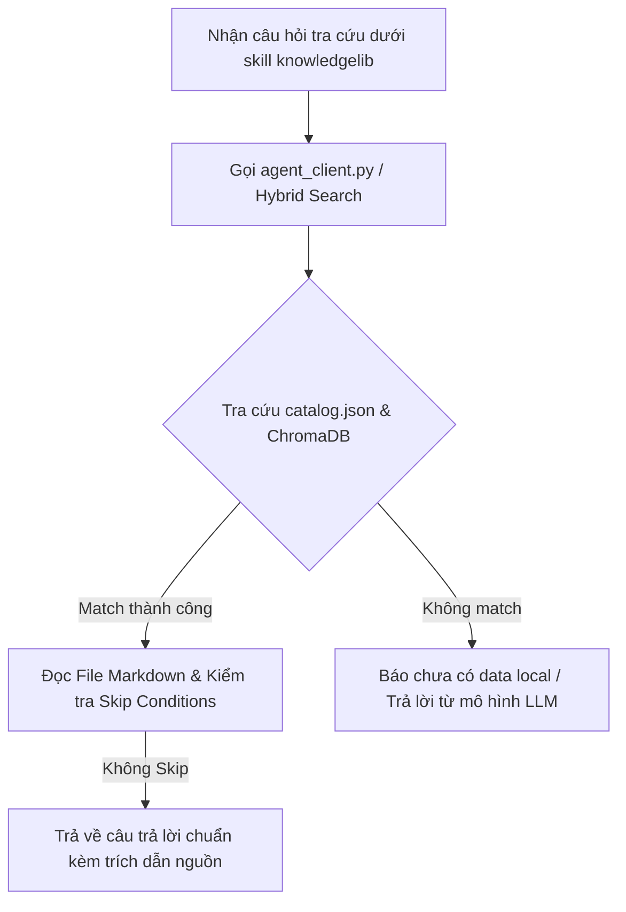

# KnowledgeLib Agent Skill Specification (`knowledgelib`)

Tệp này đóng vai trò là **Agent Skill Standard Protocol** dành cho MỌI AI Agent (Antigravity CLI, Claude Code, GitHub Copilot CLI, Amp, Cursor, Custom LLM Agents...).

---

## 1. Bản đồ Phân loại Lĩnh vực (Domain Routing Matrix)

Mọi tệp tri thức trong `knowledgelib_data` được tổ chức dạng cây (Tree Directory):

| Domain Router | Các Subdomain & Từ khóa đặc trưng | Loại thực thể |
| :--- | :--- | :--- |
| **`software` / `computing`** | System Design, DevOps, Debugging, Security, Migrations, Patterns, Hardware, Laptops | `tech_stack`, `software`, `product_comparison`, `book_chapter` |
| **`business` / `consulting`** | GTM Strategy, B2B SaaS Benchmarks, Sales Signals, Retail AI, Pitch Decks | `business_strategy`, `book_chapter` |
| **`finance` / `compliance`** | SaaS Metrics, Valuation, ISO/GDPR/SOC2 Standards, Financial Ops | `finance`, `compliance`, `book_chapter` |
| **`consumer-electronics`** | Phones, Audio, Gaming, Cameras, TVs, E-readers, Wearables | `product_comparison` |
| **`baby` / `home` / `fitness`** | Baby gear, Feeding, Smart Home, Appliances, Fitness Equipment | `product_comparison` |

---

## 2. Giao thức Tra cứu Tri thức (Query Execution Workflow)

Khi người dùng hỏi hoặc yêu cầu tra cứu tri thức local:



Lệnh thực thi tra cứu:
```bash
python3 "$KNOWLEDGELIB_PATH/agent_client.py" "câu hỏi của người dùng"
# KNOWLEDGELIB_PATH = đường dẫn tới thư mục knowledgelib_data trên máy hiện tại
```

---

## 3. Giao thức Nạp & Chuyển đổi Tài liệu Mới (Inbound Ingestion Protocol)

**DÀNH CHO BẤT KỲ AI AGENT NÀO KHI NHẬN YÊU CẦU NẠP SÁCH / PDF / TÀI LIỆU MỚI:**

Khi người dùng yêu cầu: *"Chuyển PDF này thành tri thức/skill"*, *"Nạp sách X vào kho"*, *"Import file Y vào knowledgelib"*:

### 📍 Quy tắc 1: AI Agent Tự quyết định Đường dẫn Cây thư mục (Dynamic Tree Routing)
- **KHÔNG ĐƯỢC HARDCODE ĐƯỜNG DẪN**. AI Agent thực thi lúc đó phải tự phân tích tiêu đề, mục lục và nội dung của tài liệu.
- AI Agent **TỰ QUY ĐỊNH** đường dẫn thư mục lưu trữ phù hợp nhất bên trong `knowledgelib_data`.
  - *Ví dụ Sách System Design* ➔ Agent chọn lưu vào `software/system-design/<slug-ten-sach>/`
  - *Ví dụ Tài liệu DevOps* ➔ Agent chọn lưu vào `software/devops/<slug-ten-tai-lieu>/`
  - *Ví dụ Sách Kinh doanh / SaaS* ➔ Agent chọn lưu vào `business/saas/<slug-ten-sach>/`

### 📍 Quy tắc 2: Tận dụng Mô hình LLM & Tool của chính Agent đó để Bóc tách
- Mọi AI Agent (Gemini, Claude, GPT, DeepSeek...) đều có thể dùng năng lực bóc tách/tóm tắt LLM của riêng mình hoặc dùng helper script `import_knowledge.py` để tách tài liệu thành các **Knowledge Units** (.md).

### 📍 Quy tắc 3: Định dạng Markdown & YAML Frontmatter Chuẩn
Mỗi tệp `.md` được tạo ra phải chứa Frontmatter chuẩn:
```markdown
---
id: <domain-path-do-agent-chon>/<filename-without-ext>
canonical_question: "<Tiêu đề / Câu hỏi cốt lõi của bài viết>"
aliases:
  - "<Từ khóa 1>"
  - "<Từ khóa 2>"
entity_type: book_chapter
domain: <domain > subdomain > topic>
last_verified: YYYY-MM-DD
---

# <Tiêu đề bài viết>

<Nội dung bóc tách chi tiết>
```

### 📍 Quy tắc 4: Kích hoạt Auto Sync sau khi tạo file
Sau khi AI Agent ghi các tệp `.md` vào đường dẫn do Agent quyết định, Agent thực thi lệnh sau để tự động nạp vào `catalog.json` và ChromaDB Vector Database (`.chroma_db`):

```bash
python3 "$KNOWLEDGELIB_PATH/import_knowledge.py" --sync-only
```
*Hoặc gọi trực tiếp lệnh import tự động:*
```bash
python3 "$KNOWLEDGELIB_PATH/import_knowledge.py" /path/to/document.pdf --domain-path "<path-do-agent-chon>" --domain "<domain-do-agent-chon>"
```

---

## 4. Nguyên tắc Ưu tiên tuyệt đối Data Local

- **ƯU TIÊN DATA LOCAL**: Mọi thông tin tra cứu thuộc phạm vi các Domain trên **BẮT BUỘC** lấy từ kho tệp `.md` của `knowledgelib_data`.
- KHÔNG tự suy đoán nếu chưa kiểm tra catalog và ChromaDB.
