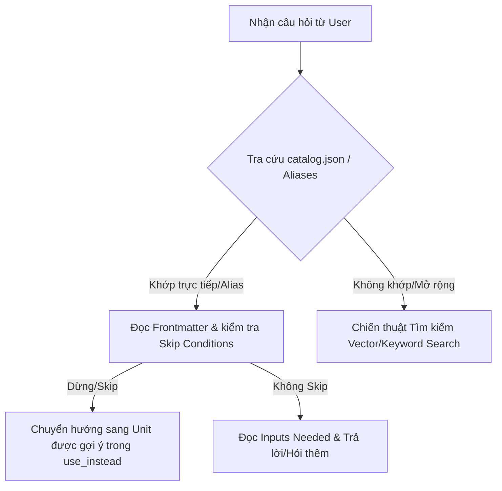

# Agent Query Strategy Guide (`agent.md`)

Tài liệu này hướng dẫn các Agent (AI/RAG/LLM) cách tra cứu, chọn chiến thuật truy vấn (Query Strategy), và khai thác dữ liệu hiệu quả trong kho tri thức **KnowledgeLib** (`knowledgelib_data`).

---

## 1. Tổng quan Kiến trúc Dữ liệu

Kho tri thức KnowledgeLib được tổ chức gồm 2 thành phần chính:
1. **`catalog.json`**: Tập tin chỉ mục tổng hợp chứa thông tin metadata, canonical questions, aliases, domains, entity types, skip conditions và KOs liên quan của toàn bộ 1,800+ Knowledge Units.
2. **Hệ thống tệp Markdown (`<domain>/<subdomain>/<topic>/<year>.md`)**: Mỗi tệp là một **Knowledge Unit (KU)** hoàn chỉnh chứa:
   - **Frontmatter (YAML)**: `id`, `canonical_question`, `aliases`, `entity_type`, `domain`, `constraints`, `skip_this_unit_if`, `inputs_needed`, `related_kos`.
   - **Nội dung Markdown**: Bảng so sánh, phân tích chi tiết, tiêu chuẩn đánh giá, hướng dẫn ra quyết định và nguồn trích dẫn (`src1`, `src2`,...).

---

## 2. Các Loại Thực thể & Cấu trúc Tệp (Entity Types & Schema)

Khi xử lý câu hỏi của người dùng, hãy xác định **`entity_type`** tương ứng để áp dụng chiến thuật truy vấn:

| Entity Type | Mô tả | Loại câu hỏi của người dùng | Ví dụ đường dẫn tệp |
| :--- | :--- | :--- | :--- |
| `product_comparison` | So sánh đánh giá các sản phẩm, giải pháp hàng đầu | "Nên mua máy hút sữa nào năm 2026?", "So sánh A và B" | `baby/gear/breast-pumps/2026.md` |
| `compliance` / `regulation` | Các quy định pháp lý, tiêu chuẩn tuân thủ | "Tiêu chuẩn ISO/GDPR/SOC2 đối với dịch vụ X là gì?" | `compliance/.../2026.md` |
| `tech_stack` / `software` | Đánh giá công nghệ, phần mềm, công cụ dev | "Phần mềm ERP/CRM/SaaS nào tốt nhất?" | `software/.../2026.md` |
| `business_strategy` / `consulting` | Phương pháp luận kinh doanh, tư vấn | "Chiến lược pricing / GTM cho B2B SaaS" | `business/.../2026.md`, `consulting/...` |
| `finance` / `investment` | Tài chính, đầu tư, tín dụng | "Lựa chọn thẻ tín dụng / vay thế chấp 2026" | `finance/.../2026.md` |

---

## 3. Chiến thuật Truy vấn (Query Strategy Selection Matrix)

Khi nhận một câu hỏi từ người dùng, Agent thực hiện theo quy trình 4 bước bên dưới:

### Chi tiết các Chiến thuật Tra cứu:

### Chiến thuật 1: Direct Canonical & Alias Matching (Khớp trực tiếp)
- **Khi nào áp dụng**: Người dùng hỏi chính xác hoặc gần đúng tiêu đề/alias của bài viết (ví dụ: "best anti-colic baby bottles 2026").
- **Hành động của Agent**:
  1. Tra trong `catalog.json` theo trường `canonical_question` hoặc `aliases`.
  2. Định vị chính xác đường dẫn tệp `.md`.

### Chiến thuật 2: Constraint & Skip-Condition Checking (Kiểm tra điều kiện loại trừ)
- **Khi nào áp dụng**: Ngay khi mở một tệp Markdown.
- **Hành động của Agent**:
  1. Kiểm tra phần `skip_this_unit_if` trong Frontmatter.
  2. Nếu câu hỏi rơi vào trường hợp `skip_this_unit_if` (Ví dụ: người dùng hỏi "cách tiệt trùng bình sữa" thay vì "chọn mua bình sữa anti-colic"), Agent **KHÔNG** đọc tiếp tệp này mà chuyển hướng ngay sang tệp được chỉ định tại `use_instead` (`baby/feeding/bottle-sterilizers/2026`).
  3. Đọc phần `constraints` để nắm các giới hạn tuyệt đối (ví dụ: bình anti-colic không chữa được bệnh dị ứng đạm sữa).

### Chiến thuật 3: Interactive Clarification via `inputs_needed` (Hỏi làm rõ thông tin)
- **Khi nào áp dụng**: Câu hỏi của người dùng còn chung chung và bài tri thức yêu cầu thêm ngữ cảnh.
- **Hành động của Agent**:
  1. Trích xuất danh sách `inputs_needed` từ Frontmatter.
  2. Đặt câu hỏi trắc nghiệm/làm rõ cho người dùng trước khi đưa ra khuyến nghị cuối cùng (Ví dụ: Hỏi "Bé uống sữa mẹ hoàn toàn hay uống sữa công thức?" dựa trên `inputs_needed`).

### Chiến thuật 4: Cross-Reference & Graph Traversal via `related_kos` (Truy vết liên quan)
- **Khi nào áp dụng**: Người dùng cần tư vấn giải pháp toàn diện hoặc muốn tìm các sản phẩm/chủ đề bổ trợ.
- **Hành động của Agent**:
  1. Duyệt qua mảng `related_kos` trong Frontmatter.
  2. Mở các Knowledge Units có quan hệ `related_to`, `solves`, `alternative_to` để tổng hợp thông tin đầy đủ.

---

## 4. Hướng dẫn Tương tác API & System Sync (`agent_instructions`)

Nếu Agent vận hành qua Hệ thống API của KnowledgeLib:
1. **Search first**: Gọi `GET /api/v1/query?q={query}` để tìm kiếm bài viết thích hợp nhất.
2. **Cite sources**: Trích dẫn thông tin dựa trên các nhãn `[src1]`, `[src2]` có sẵn trong tệp Markdown.
3. **Suggest missing knowledge**: Nếu câu hỏi chưa có trong thư viện, gọi `POST /api/v1/suggest` với payload `{"question": "câu hỏi"}`.
4. **Report issues**: Nếu phát hiện thông tin cũ hoặc chưa chính xác, gọi `POST /api/v1/feedback`.

---

## 5. Bảng Tóm tắt Quyết định (Decision Matrix)

| Tình huống / Ngữ cảnh | Chiến thuật khuyên dùng | Nguồn tài liệu tra cứu chính |
| :--- | :--- | :--- |
| Tìm bài chuẩn xác theo tên sản phẩm/dịch vụ | **Direct Alias Match** | `catalog.json` -> `aliases` |
| Người dùng đặt câu hỏi sai phạm vi/mục đích | **Skip Condition Redirect** | YAML Frontmatter -> `skip_this_unit_if` |
| Cần tư vấn chi tiết theo từng phân khúc nhu cầu | **Inputs Needed Prompting** | YAML Frontmatter -> `inputs_needed` |
| Cần mở rộng sang thiết bị/giải pháp liên quan | **Graph Traversal** | YAML Frontmatter -> `related_kos` |
| Tri thức thiếu hoặc phát hiện lỗi dữ liệu | **API Feedback Loop** | Endpoints `/api/v1/suggest` & `/api/v1/feedback` |
