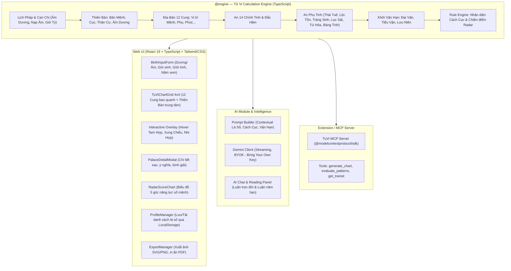

# Kế Hoạch Chi Tiết Nâng Cấp Hệ Thống Tử Vi (Tu Vi App)

> **Mục tiêu**: Nâng cấp `tu-vi-app-poc` từ một ứng dụng chuyển đổi âm dương & tứ trụ cơ bản thành một nền tảng **Tử Vi Đẩu Số hiện đại, toàn diện**: kết hợp thuật toán an sao cổ truyền chuẩn xác, giao diện bàn cờ trực quan tương tác cao, nhận diện cách cục kinh điển, tích hợp AI luận giải chuyên sâu và hỗ trợ giao thức MCP Server cho AI Agent.

---

## 1. Hiện Trạng Nhánh `main` của Repo Chúng Ta

Qua rà soát mã nguồn trên nhánh `main` (`7ee0dad`), hệ thống hiện có:

| Hạng mục | Đã triển khai trên `main` | Hạn chế / Chưa có |
| :--- | :--- | :--- |
| **Lịch pháp & Can Chi** | Chuyển đổi Dương lịch sang Âm lịch (thuật toán Hồ Ngọc Đức, timezone GMT+7); tính Can Chi 4 trụ: Năm, Tháng, Ngày, Giờ (Ngũ Dần độn nguyên, Ngũ Tý tuần hoàn, Can Chi ngày qua Julian Day). | Chưa có Ngũ Hành Nạp Âm 60 Hoa Giáp; Chưa xét giờ Tý đầu ngày (0h-1h) / giờ Tý cuối ngày (23h-24h) linh hoạt; Chưa có tiết khí Bát Tự sâu. |
| **Lõi Tử Vi (Engine)** | `tinhTuTru()` tính 4 cặp Can - Chi. | **Hoàn toàn chưa có lõi Tử Vi Đẩu Số**: Chưa xác định Cung Mệnh/Cung Thân; Chưa tính Cục; Chưa an 14 Chính Tinh; Chưa an các vòng Phụ Tinh (Thái Tuế, Bác Sĩ, Tràng Sinh, Lục Sát, Tứ Hóa, v.v.); Chưa có miếu hãm; Chưa có Đại vận/Tiểu vận/Lưu niên. |
| **Giao diện Web** | React 19 + Vite + TypeScript. Form nhập ngày giờ sinh dương lịch, bảng kết quả hiển thị thông tin Âm/Dương và bảng 4 Trụ Can Chi đơn giản. | Chưa có bàn cờ 12 Cung truyền thống; Chưa có tương tác Tam Hợp, Xung Chiếu; Chưa responsive đa thiết bị; Chưa có visual theme phong thủy. |
| **Luận giải & AI** | Chưa có. | Chưa có dữ liệu luận giải mẫu hay kết nối LLM. |
| **Dữ liệu & Xuất bản** | Dữ liệu chỉ hiển thị tức thì trên State React. | Không lưu trữ (LocalStorage/IndexedDB); Không xuất ảnh (SVG/PNG/PDF). |

---

## 2. Phân Tích & Rút Tỉa Tinh Hoa Từ 5 Repo Tham Khảo

```
                     ┌──────────────────────────────────────────────┐
                     │         Tham Khảo Kiến Trúc 5 Repos          │
                     └──────────────────────────────────────────────┘
                                     │
         ┌───────────────────────────┼───────────────────────────┐
         ▼                           ▼                           ▼
  [doanguyen/lasotuvi]        [hataiit9x/tuvi-ai]        [nmhaaa3218/TuViMCP]
   Chuẩn mực An sao Tử Vi       Fullstack TypeScript       Cơ sở dữ liệu Cách Cục
   & Mô hình Thiên/Địa Bàn     Grid 4x4 & AI Prompting     & Giao thức MCP Server
         │                           │                           │
         └─────────────┬─────────────┴─────────────┬─────────────┘
                       ▼                           ▼
             [minhtuanbk/tuvilyso]    [aiainguyendzung-tech]
              Lưu trữ Offline &        Gemini Streaming &
              Tùy biến sao cá nhân     Output Contracts
```

### 2.1. `doanguyen/lasotuvi` (Python)
* **Giá trị chắt lọc**:
  * Chuẩn mực thuật toán An Sao Nam Phái cổ truyền (theo *Tử Vi Đẩu Số Toàn Thư*).
  * Tách bạch kiến trúc cực kỳ sáng sủa:
    * **Thiên Bàn**: Chứa thông tin bản mệnh của đương số, Ngũ Hành Bản Mệnh (Nạp Âm), Cục, Thân cư, tương quan Sinh - Khắc giữa Mệnh và Cục, tương quan Can - Chi năm sinh (Âm Dương thuận/nghịch lý).
    * **Địa Bàn**: 12 cung từ Tý đến Hợi, gán sao, độ sáng (Miếu, Vượng, Đắc, Hãm), Triệt Lộ, Tuần Trung, Vận Hạn (Đại hạn, Tiểu hạn).
  * Bộ quy tắc an hơn 100 sao và công thức tính toán toán học chính xác.

### 2.2. `hataiit9x/tuvi-ai` (TypeScript / React)
* **Giá trị chắt lọc**:
  * Toàn bộ mã nguồn Engine an sao đã được viết bằng **TypeScript** (`server/services/tuvi.ts`), tương thích 100% với stack của chúng ta.
  * Thiết kế UI **Bàn cờ 4x4 Grid** (`TuViChartGrid.tsx`, `PalaceCell.tsx`): 12 cung Địa Bàn bao quanh khung viền, 4 ô trung tâm gộp thành Thiên Bàn.
  * Tương tác người dùng: Click xem chi tiết từng cung (`PalaceDetailModal.tsx`), highlight quan hệ Tam Hợp / Xung Chiếu khi hover.
  * Chấm điểm chỉ số Mệnh lý và trực quan hóa bằng **Biểu đồ Radar** (Công danh, Tài lộc, Tình duyên, Sức khỏe, Phúc đức).
  * Cấu trúc Prompt AI phân tích lá số: Phân tách rõ phân tích tổng quan và phân tích riêng từng cung dựa trên chính tinh, phụ tinh và tam phương tứ chính.

### 2.3. `nmhaaa3218/TuViMCP` (Python MCP Server)
* **Giá trị chắt lọc**:
  * **Kho dữ liệu Cách Cục kinh điển** (`cach_cuc.json` & `cach_cuc_evaluator.py`): Nhận diện tự động các cách cục cát tường (Tam Kỳ Gia Hội, Tử Phủ Vũ Tướng, Thạch Trung Ẩn Ngọc, v.v.) và hung họa (Mệnh Vô Chính Diệu ngộ sát tinh, Kình Đà giáp Kỵ, v.v.) kèm Cổ ca (thơ chữ Hán/Việt) và bình chú phân tích.
  * **Hệ thống Vận Hạn (Transit Analysis)**: An các sao Lưu động theo năm xem hạn (Lưu Thái Tuế, Lưu Tang Môn, Lưu Bạch Hổ, Lưu Lộc Tồn, Lưu Kình Dương, Lưu Đà La, Lưu Thiên Mã, v.v.).
  * **Chuẩn Model Context Protocol (MCP)**: Biến thư viện thành MCP Server cho LLM Agents (Claude Desktop, Cline, Cursor, Antigravity) truy vấn qua JSON-RPC.

### 2.4. `minhtuanbk/tuvilyso` (JavaScript / Vue 3)
* **Giá trị chắt lọc**:
  * Tính năng **quản lý lá số offline**: Cho phép lưu trữ danh sách lá số trực tiếp trên trình duyệt (LocalStorage / IndexedDB).
  * Tính năng **tùy chỉnh sao**: Cho phép người dùng linh hoạt điều chỉnh một số quy tắc an sao theo trường phái cá nhân hoặc khảo nghiệm giờ sinh.

### 2.5. `aiainguyendzung-tech/FengShui-TuVi-v2.2` (TypeScript / AI Studio)
* **Giá trị chắt lọc**:
  * Kiến trúc tích hợp **Google Gemini GenAI SDK** chuyên nghiệp: Streaming response, parser JSON chịu lỗi (`jsonRepair`), Fallback khi lỗi API key/mất mạng.
  * **Output Contract có cấu trúc nghiêm ngặt**: Định nghĩa rõ ràng schema kết quả của AI để hiển thị mượt mà trên UI.

---

## 3. Kiến Trúc Tổng Thể Mục Tiêu



---

## 4. Kế Hoạch Triển Khai Chi Tiết (Implementation Roadmap)

### Phase 1: Nâng Cấp Toàn Diện Engine An Sao Tử Vi (`src/engine`)
> **Mục tiêu**: Đưa engine hiện tại trở thành thư viện An Sao Tử Vi chuẩn xác, đầy đủ quy tắc, 100% TypeScript, có unit test bao phủ.

- [ ] **1.1. Bổ sung Ngũ Hành Nạp Âm & Âm Dương Bản Mệnh**:
  - Bảng 60 Hoa Giáp Nạp Âm (từ Giáp Tý - Hải Trung Kim đến Quý Hợi - Đại Hải Thủy).
  - Xác định Âm Nam, Dương Nam, Âm Nữ, Dương Nữ dựa trên Can Chi năm sinh và giới tính.
  - Xử lý mốc giờ sinh chuẩn theo địa chi (Tý: 23h-01h, Sửu: 01h-03h,...), cho phép cấu hình Tý sớm (0h-1h) / Tý muộn (23h-24h).
- [ ] **1.2. Xác định Cung Mệnh, Cung Thân và 12 Cung Chức**:
  - Công thức tìm cung Mệnh: Khởi từ Dần (tháng 1) đếm thuận tới tháng sinh, từ đó đếm nghịch tới giờ sinh.
  - Công thức tìm cung Thân: Khởi từ Dần (tháng 1) đếm thuận tới tháng sinh, từ đó đếm thuận tới giờ sinh.
  - Phân bổ 12 Cung chức theo chiều nghịch (hoặc quy ước chuẩn): Mệnh $\rightarrow$ Phụ Mẫu $\rightarrow$ Phúc Đức $\rightarrow$ Điền Trạch $\rightarrow$ Quan Lộc $\rightarrow$ Nô Bộc $\rightarrow$ Thiên Di $\rightarrow$ Tật Ách $\rightarrow$ Tài Bạch $\rightarrow$ Tử Tức $\rightarrow$ Phu Thê $\rightarrow$ Huynh Đệ.
- [ ] **1.3. Xác định Cục (Ngũ Hành Cục)**:
  - Căn cứ vào Can năm sinh và vị trí Địa Chi của cung Mệnh để tìm Cục: Thủy Nhị Cục (2), Mộc Tam Cục (3), Kim Tứ Cục (4), Thổ Ngũ Cục (5), Hỏa Lục Cục (6).
  - Xác định tương quan giữa Bản Mệnh và Cục (Mệnh Cục tương sinh, tương khắc, tương hòa).
- [ ] **1.4. An 14 Chính Tinh & Đắc Miếu Hãm**:
  - Thuật toán tìm vị trí sao Tử Vi dựa vào ngày sinh âm lịch và số Cục.
  - An chòm Tử Vi (nghịch chiều): Tử Vi, Liêm Trinh, Thiên Đồng, Vũ Khúc, Thái Dương, Thiên Cơ.
  - An chòm Thiên Phủ (đối xứng qua trục Dần - Thân): Thiên Phủ, Thái Âm, Tham Lang, Cự Môn, Thiên Tướng, Thiên Lương, Thất Sát, Phá Quân.
  - Bảng tra cứu độ sáng (Miếu, Vượng, Đắc, Hãm) của 14 chính tinh tại 12 cung Tý - Hợi.
- [ ] **1.5. An hệ thống Phụ Tinh chuẩn Tử Vi Nam Phái**:
  - *Vòng Thái Tuế* (12 sao): Thái Tuế, Thiếu Dương, Tang Môn, Thiếu Âm, Quan Phù, Tử Phù, Tuế Phá, Long Đức, Bạch Hổ, Phúc Đức, Điếu Khách, Trực Phù.
  - *Vòng Lộc Tồn (Bác Sĩ)* (12 sao): Bác Sĩ, Lực Sĩ, Thanh Long, Tiểu Hao, Tướng Quân, Tấu Thư, Phi Liêm, Hỷ Thần, Bệnh Phù, Đại Hao, Phục Binh, Quan Phủ (theo chiều Dương Nam Âm Nữ thuận, Âm Nam Dương Nữ nghịch).
  - *Vòng Tràng Sinh* (12 sao): Khởi theo Cục tại Tứ Sinh (Dần Thân Tỵ Hợi): Tràng Sinh, Mộc Dục, Quan Đới, Lâm Quan, Đế Vượng, Suy, Bệnh, Tử, Mộ, Tuyệt, Thai, Dưỡng.
  - *Lục Sát Tinh*: Kình Dương, Đà La (theo Lộc Tồn); Địa Không, Địa Kiếp (theo giờ sinh); Hỏa Tinh, Linh Tinh (theo năm và giờ sinh).
  - *Tứ Hóa*: Hóa Lộc, Hóa Quyền, Hóa Khoa, Hóa Kỵ (theo Thiên Can năm sinh).
  - *Bộ Cát Tinh*: Văn Xương, Văn Khúc, Tả Phụ, Hữu Bật, Thiên Khôi, Thiên Việt, Tam Thai, Bát Tọa, Ân Quang, Thiên Quý, Long Trì, Phượng Các, Đào Hoa, Hồng Loan, v.v.
  - *Sao đôi & Không vong*: Cô Thần, Quả Tú, Kiếp Sát, Hoa Cái, Thiên Mã, Phá Toái; Tuần Trung Không Vong, Triệt Lộ Không Vong.
- [ ] **1.6. Tính Vận Hạn**:
  - Khởi Đại Vận (10 năm): Bắt đầu từ số Cục tại Cung Mệnh, di chuyển thuận (Dương Nam, Âm Nữ) hoặc nghịch (Âm Nam, Dương Nữ).
  - Tính Tiểu Vận (1 năm) và Lưu Niên Thái Tuế.
  - An các sao Lưu niên cho năm khảo sát (Lưu Thái Tuế, Lưu Kình, Lưu Đà, Lưu Mã...).
- [ ] **1.7. Unit Tests Vitest**:
  - Viết bộ kiểm thử hồi quy với ít nhất 10 lá số mẫu chuẩn mực đối chiếu với `doanguyen/lasotuvi` và các trang lập lá số uy tín.

---

### Phase 2: Thiết Kế UI Bàn Cờ 12 Cung Truyền Thống (`web/src`)
> **Mục tiêu**: Tạo giao diện bàn cờ chuẩn 4x4, thẩm mỹ truyền thống nhưng phong cách hiện đại, trực quan và tương tác thông minh.

- [ ] **2.1. Cấu Trúc Bàn Cờ 4x4 Grid**:
  - 12 cung sắp xếp đúng vòng Địa Chi cố định:
    - Hàng 1 (trên cùng): Tỵ, Ngọ, Mùi, Thân
    - Hàng 2: Thìn (trái), [Thiên Bàn (2x2)], Dậu (phải)
    - Hàng 3: Mão (trái), [Thiên Bàn (2x2)], Tuất (phải)
    - Hàng 4 (dưới cùng): Dần, Sửu, Tý, Hợi
- [ ] **2.2. Component `PalaceCell` (Ô Cung)**:
  - Header: Tên cung chức (MỆNH, QUAN LỘC, TÀI BẠCH...), Can Chi của cung, ghi chú Cung Thân.
  - Cột Chính Tinh: Tên sao to, in đậm, màu theo Ngũ Hành (Kim: Trắng/Vàng nhạt, Mộc: Xanh lá, Thủy: Xanh dương/Đen, Hỏa: Đỏ, Thổ: Nâu/Vàng đất); hiển thị nhãn độ miếu hãm `(M)`, `(V)`, `(Đ)`, `(H)`.
  - Cột Phụ Tinh: Tách rõ Cát tinh (màu đỏ/xanh lá) bên trái, Hung sát tinh (màu lam đậm/xám) bên phải.
  - Footer: Sao Vòng Tràng Sinh, số tuổi khởi Đại Vận, địa chi Tiểu Vận, nhãn hiệu Tuần/Triệt nổi bật.
- [ ] **2.3. Component `ThienBan` (Trung Tâm Bàn Cờ)**:
  - Thông tin đương số: Họ tên, giới tính, giờ/ngày/tháng/năm sinh Âm - Dương.
  - Thông tin Bát Tự (Năm, Tháng, Ngày, Giờ Can Chi).
  - Mệnh ngũ hành (Nạp âm), Cục số, Thân cư cung nào.
  - Nhận định: Âm Dương thuận/nghịch lý; Mệnh Cục tương sinh/khắc.
  - Chủ Mệnh, Chủ Thân, Năm xem hạn.
- [ ] **2.4. Tính Năng Chiếu Cung Tương Tác (Tam Hợp & Xung Chiếu)**:
  - Khi hover/click vào 1 cung: Tự động kẻ đường line hoặc highlight 3 cung liên đới:
    - Cung Xung Chiếu (cách 6 cung).
    - Cung Tam Hợp (cách 4 cung và 8 cung).
    - Cung Nhị Hợp.
  - Drawer / Modal xem nhanh tổng hợp sao hội chiếu về cung đang chọn.
- [ ] **2.5. Responsive Design**:
  - Hỗ trợ chế độ xem đầy đủ trên Desktop/Tablet.
  - Chế độ Mobile: Cho phép vuốt chuyển cung hoặc chuyển đổi giữa dạng Bàn cờ thu nhỏ (pinch-to-zoom) và Dạng danh sách thẻ (Accordion/Card list).

---

### Phase 3: Rule Engine — Nhận Diện Cách Cục & Chấm Điểm Chỉ Số
> **Mục tiêu**: Tự động nhận diện thế trận các sao và cung cấp chỉ số trực quan giúp người xem nhanh chóng nắm bắt bản mệnh.

- [ ] **3.1. Hệ Thống Dữ Liệu Cách Cục (`cach_cuc.json`)**:
  - Chuyển giao và chuẩn hóa bộ dữ liệu hơn 60 cách cục kinh điển từ `TuViMCP`:
    - Cát cách: *Tam Kỳ Gia Hội, Tử Phủ Vũ Tướng, Sát Phá Tham, Cơ Nguyệt Đồng Lương, Nhật Lệ Trung Thiên, Thạch Trung Ẩn Ngọc, Mã Ngộ Tràng Sinh...*
    - Hung cách: *Kình Đà Giáp Kỵ, Mệnh Vô Chính Diệu đắc Tam Không, Hình Tù Giáp Ấn, Hỏa Linh Kiếp Sát...*
  - Mỗi cách cục đi kèm: Tên, Phân loại, Tiêu chí thỏa mãn, Thơ cổ ca, Giải nghĩa hiện đại.
- [ ] **3.2. Bộ Đánh Giá Tự Động (`evaluatePatterns`)**:
  - Thuật toán duyệt qua Mệnh, Thân, Tài, Quan, Di để đối soát điều kiện sao và tam phương tứ chính.
  - Trả về danh sách cách cục đương số sở hữu kèm mức độ ảnh hưởng (Chính cách hay Bàng cách).
- [ ] **3.3. Bộ Chấm Điểm & Biểu Đồ Radar (`IndicatorsRadarChart`)**:
  - Đánh giá trọng số điểm các cung trọng yếu:
    - *Công danh sự nghiệp* (Quan Lộc + Mệnh + Khôi Việt/Xương Khúc/Khoa Quyền)
    - *Tài chính của cải* (Tài Bạch + Điền Trạch + Vũ Khúc/Thái Âm/Lộc Tồn/Hóa Lộc)
    - *Tình duyên gia đạo* (Phu Thê + Tử Tức + Đào Hồng/Hóa Kỵ/Cô Quả)
    - *Sức khỏe tuổi thọ* (Tật Ách + Phúc Đức + Kình Đà/Không Kiếp/Bệnh Phù)
    - *Phúc ấm căn cơ* (Phúc Đức + Tổ nghiệp)
  - Vẽ biểu đồ Radar trực quan (Recharts hoặc Chart.js).

---

### Phase 4: Module AI Luận Giải Lá Số (Gemini / LLM Integration)
> **Mục tiêu**: Ứng dụng AI thông minh giúp luận giải lá số một cách sống động, cá nhân hóa, có cơ sở học thuật vững chắc.

- [ ] **4.1. Thiết Kế Prompt Engineering Chuyên Biệt**:
  - Rút kinh nghiệm từ `tuvi-ai` và `FengShui-TuVi-v2.2`:
    - Context đưa vào LLM được cấu trúc hóa bằng JSON sạch: Thông tin đương số, Mệnh Cục, 12 cung chức, danh sách chính tinh đắc hãm, các bộ sao phụ chiếu, các cách cục đã nhận diện.
    - System prompt thiết lập văn phong: Chuẩn mực, thấu đáo, mang tính xây dựng và định hướng phát triển bản thân (né mê tín tiêu cực, dọa dẫm).
- [ ] **4.2. Trình Quản Lý Kết Nối AI (BYOK - Bring Your Own Key)**:
  - Cho phép người dùng nhập API Key (Google Gemini API / OpenAI) lưu trong `localStorage` cá nhân (an toàn, không lưu server).
  - Tích hợp `@google/genai` SDK với chế độ **Streaming response** để tạo trải nghiệm phản hồi mượt mà từng từ.
  - Bộ kiểm tra định dạng và parser an toàn chống lỗi đứt gãy JSON (`jsonRepair`).
- [ ] **4.3. Các Tính Năng Luận Giải Chính**:
  - **Luận giải Tổng Quan Bản Mệnh**: Phân tích tính cách, sở trường, sở đoản, định hướng nghề nghiệp và bài học cuộc đời.
  - **Luận giải Từng Cung Chuyên Sâu**: Click vào cung nào có nút "Luận giải cung này bằng AI".
  - **Luận giải Vận Hạn Năm**: Phân tích tương quan giữa Tiểu Vận, Lưu Niên và Đại Vận hiện tại.
  - **AI Chatbot Đồng Hành**: Hộp chat hỏi đáp tức thì về lá số của đương số.

---

### Phase 5: Quản Lý Dữ Liệu Hồ Sơ & Xuất Bản (Data & Export)
> **Mục tiêu**: Hoàn thiện trải nghiệm người dùng, biến app thành công cụ làm việc và lưu trữ lá số thực thụ.

- [ ] **5.1. Quản Lý Hồ Sơ Lá Số (Profile Library)**:
  - Sử dụng `localStorage` / `IndexedDB` để lưu danh sách lá số đã tạo.
  - Tìm kiếm theo tên, phân nhóm tag (Gia đình, Bạn bè, Khách hàng, Nghiên cứu).
  - Xuất / Nhập (Export / Import) toàn bộ dữ liệu ra file `.json` để sao lưu hoặc chuyển đổi thiết bị.
- [ ] **5.2. Xuất Ảnh & In Ấn (Export to SVG / PNG / PDF)**:
  - Render lá số ra định dạng vector SVG độ nét cao (kế thừa template từ `doanguyen/lasotuvi`).
  - Hỗ trợ nút "Lưu ảnh lá số (PNG)" và "In / Xuất PDF" chuẩn trang A4 để lưu trữ hoặc chia sẻ mạng xã hội.
- [ ] **5.3. Bảng Tùy Biến Thiết Lập (Settings)**:
  - Tùy chọn giờ Tý (Tý đổi ngày lúc 23h hay 0h).
  - Tùy chọn an Thiên Khôi / Thiên Việt (theo trường phái Canh: Dần/Ngọ hay Ngọ/Dần).
  - Tùy chọn giao diện (Sáng / Tối / Giấy cổ phong thủy).

---

### Phase 6: Mở Rộng Giao Thức Model Context Protocol (TuVi MCP Server)
> **Mục tiêu**: Biến dự án thành một MCP Server chuẩn, cho phép các AI Assistant (Cursor, Claude Desktop, Antigravity) kết nối và khai thác trực tiếp dữ liệu lá số.

- [ ] **6.1. Xây Dựng MCP Package (`@tuvi/mcp-server`)**:
  - Triển khai bằng `@modelcontextprotocol/sdk` (TypeScript) chạy trên nền `stdio` hoặc `SSE`.
  - Cung cấp CLI khởi chạy: `npx tuvi-mcp-server`.
- [ ] **6.2. Danh Sách MCP Tools**:
  - `generate_tuvi_chart`: Nhập ngày giờ sinh, xuất ra JSON lá số đầy đủ 12 cung và sao.
  - `get_palace_details`: Trích xuất chi tiết 1 cung kèm tam hợp, xung chiếu, nhị hợp.
  - `evaluate_patterns`: Trả về các cách cục lá số thỏa mãn.
  - `get_transit_analysis`: Phân tích vận hạn của một năm chỉ định.

---

## 5. Bảng So Sánh & Kế Hoạch Đóng Gói (Deliverables)

| Hạng mục | Nhánh `main` hiện tại | Sau khi hoàn thành Kế hoạch | Nguồn cảm hứng chính |
| :--- | :--- | :--- | :--- |
| **Engine An Sao** | Chỉ có Can Chi & Tứ Trụ | 14 Chính Tinh, hơn 100 Phụ Tinh, Miếu Hãm, Cục, Vận Hạn | `doanguyen/lasotuvi`, `hataiit9x/tuvi-ai` |
| **Bàn Cờ Hiển Thị** | Bảng 4 cột Tứ Trụ đơn giản | Bàn cờ 4x4 Grid truyền thống, highlight Tam Hợp/Xung Chiếu | `hataiit9x/tuvi-ai`, `minhtuanbk/tuvilyso` |
| **Nhận Diện Cách Cục** | Chưa có | Tự động nhận diện >60 Cát/Hung cách + Thơ ca bình chú | `nmhaaa3218/TuViMCP` |
| **Đánh Giá Trực Quan** | Không có | Biểu đồ Radar 5 góc (Công danh, Tài lộc, Tình duyên...) | `hataiit9x/tuvi-ai` |
| **Trí Tuệ Nhân Tạo AI** | Chưa có | Gemini Streaming AI luận giải trọn đời, từng cung & Vận hạn | `hataiit9x/tuvi-ai`, `FengShui-TuVi-v2.2` |
| **Lưu Trữ & Xuất Bản** | Mất khi F5 trình duyệt | Lưu thư viện lá số offline, Xuất ảnh PNG/SVG, In PDF | `minhtuanbk/tuvilyso`, `doanguyen/lasotuvi` |
| **Khả Năng Tích Hợp AI** | Không có | TypeScript Model Context Protocol (MCP) Server | `nmhaaa3218/TuViMCP` |

---

## 6. Lộ Trình Triển Khai Đề Xuất Theo Từng Giai Đoạn (Sprint)

```
[Sprint 1: Engine Core]     ──► Phase 1 (Nạp Âm, Cục, 12 Cung, 14 Chính Tinh, Phụ Tinh, Vitest)
[Sprint 2: Bàn Cờ 4x4 UI]   ──► Phase 2 (Grid 4x4, PalaceCell, ThienBan, Highlight Tam Hợp)
[Sprint 3: Cách Cục & Radar]──► Phase 3 (Dữ liệu cach_cuc.json, Rule Engine, Biểu đồ Radar)
[Sprint 4: AI Luận Giải]    ──► Phase 4 (Prompting, Gemini SDK Streaming, Luận cung & Vận hạn)
[Sprint 5: UX & Export]     ──► Phase 5 (Quản lý hồ sơ LocalStorage, Xuất ảnh PNG/SVG/PDF)
[Sprint 6: MCP Server]      ──► Phase 6 (@modelcontextprotocol/sdk integration)
```
